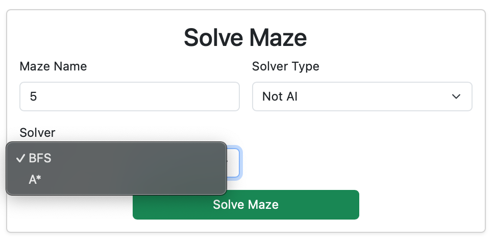
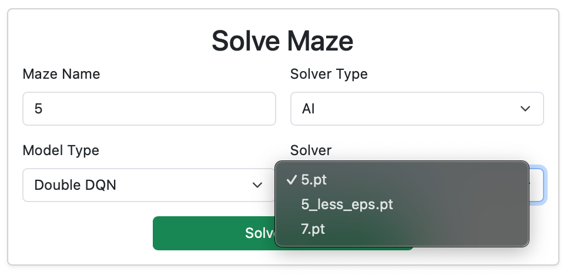
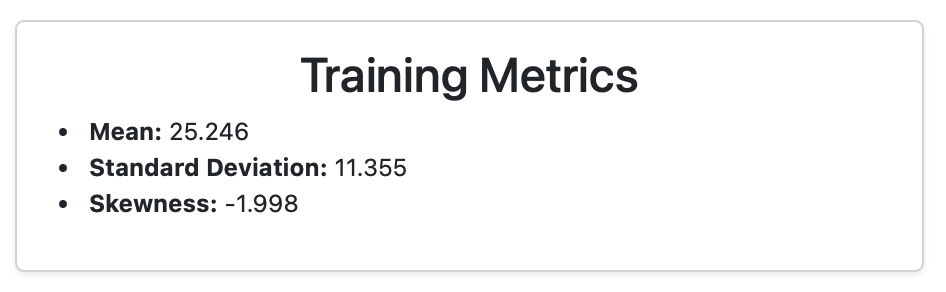
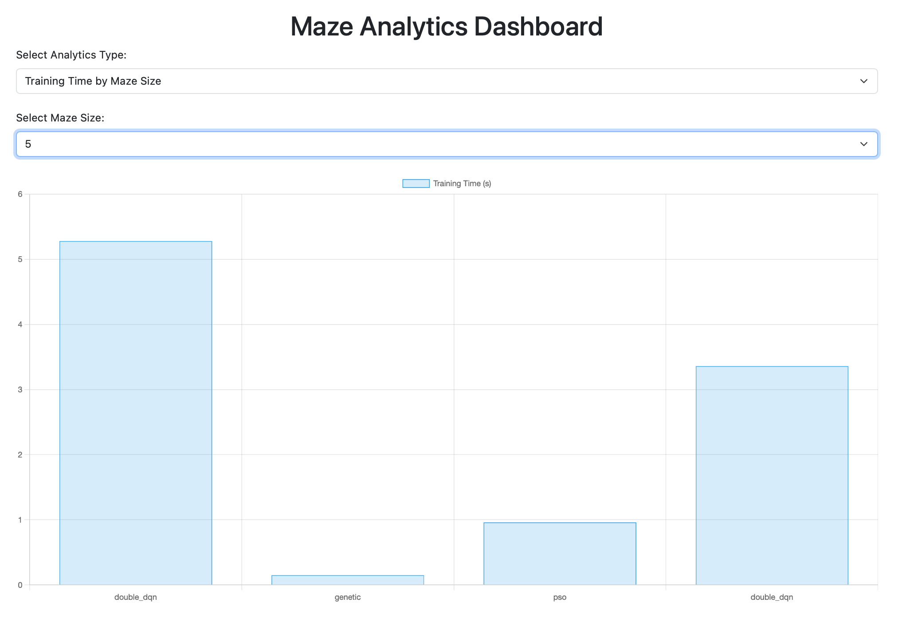

# Maze Solver
Maze Solver jest aplikacją do generowania i rozwiązywania labiryntów. 

---

## Spis Treści
- [Maze Solver](#maze-solver)
  - [Spis Treści](#spis-treści)
- [Wprowadzenie](#wprowadzenie)
  - [Kluczowe funkcjonalności](#kluczowe-funkcjonalności)
  - [Użyte technologie](#użyte-technologie)
  - [Instalacja](#instalacja)
    - [1. Sklonuj repozytorium](#1-sklonuj-repozytorium)
    - [2. Utwórz wirtualne środowisko](#2-utwórz-wirtualne-środowisko)
    - [Zainstaluj zależności](#zainstaluj-zależności)
- [Instrukcja użycia](#instrukcja-użycia)
  - [Uruchomienie aplikacji](#uruchomienie-aplikacji)
  - [Funkcjonalność](#funkcjonalność)
  - [Generowanie labiryntu](#generowanie-labiryntu)
  - [Trenowanie Modelu](#trenowanie-modelu)
  - [Rozwiązywanie labiryntu](#rozwiązywanie-labiryntu)
  - [Analityka](#analityka)
    - [Metryki](#metryki)
    - [Dashboard - statystyki](#dashboard---statystyki)
- [Algorytmy i Rozwiązania](#algorytmy-i-rozwiązania)
  - [Główna logika związana z labiryntami.](#główna-logika-związana-z-labiryntami)
  - [Rozwiązania związane z częscią aplikacji webowej](#rozwiązania-związane-z-częscią-aplikacji-webowej)
    - [Endpointy aplikacji](#endpointy-aplikacji)
    - [Wyjaśnienie działania plików JavaScript](#wyjaśnienie-działania-plików-javascript)
      - [**`script.js`**](#scriptjs)
      - [**`dashboard.js`**](#dashboardjs)
- [Szczegóły Techniczne](#szczegóły-techniczne)
---

# Wprowadzenie

Projekt **Maze Solver** to aplikacja wykorzystująca algorytmy sztucznej inteligencji i klasyczne techniki rozwiązywania problemów do znajdowania optymalnych ścieżek w labiryntach o różnej wielkości i złożoności. 

Główne cele projektu to:
- Eksploracja zastosowań algorytmów AI (np. DQN, Double DQN) i klasycznych metod (np. BFS, A*) w rozwiązywaniu labiryntów.
- Porównanie wydajności różnych podejść w kontekście czasu rozwiązania, długości ścieżki i stabilności wyników.
- Udostępnienie interfejsu webowego, który umożliwia wizualizację i analizę wyników.


## Kluczowe funkcjonalności

- **Rozwiązywanie labiryntów**:
  - Algorytmy klasyczne: BFS, A*.
  - Algorytmy oparte na AI: DQN, Double DQN, algorytmy genetyczne i PSO.
- **Generowanie i wizualizacja labiryntów**:
  - Różne rozmiary i poziomy złożoności.
- **Interfejs webowy**:
  - Zarządzanie, analiza i porównanie wyników.
- **Analityka i wizualizacja danych**:
  - Wydajność algorytmów w zależności od rozmiaru i złożoności labiryntów.


## Użyte technologie

1. **Python**:
   - Główna logika aplikacji.
   - Algorytmy rozwiązywania labiryntów.
2. **PyTorch**:
   - Funkcjonalność machine learningowa (definicje modeli, trening, rozwiązywanie labiryntów)
2. **Flask**:
   - Interfejs webowy do interakcji z użytkownikiem.
3. **Chart.js**:
   - Wizualizacja wyników i analityki.
4. **Pandoc**:
   - Automatyczna konwersja dokumentacji do formatu PDF (via Github Actions)

## Instalacja

### 1. Sklonuj repozytorium
```bash
git clone https://github.com/NatProView/project_maze_solver maze_solver
cd maze_solver
```

### 2. Utwórz wirtualne środowisko
Na systemie Linux/macOS:
```bash
python3 -m venv env
source env/bin/activate
```

Na systemie Windows:
```powershell
python -m venv env
.\env\Scripts\activate
```
### Zainstaluj zależności
```bash
pip install -r requirements.txt
```

# Instrukcja użycia
## Uruchomienie aplikacji 
Uruchom aplikację
```
python3 app.py
```
Aplikacja zwróci w terminalu informację o adresie i porcie, na którym działa. Wejdź w ten adres.

Przykładowo
```bash
python3 app.py 
 * Serving Flask app 'app'
 * Debug mode: on
WARNING: This is a development server. Do not use it in a production deployment. Use a production WSGI server instead.
 * Running on http://127.0.0.1:5000 # nasz adres
(...)
```
## Funkcjonalność
Tak wygląda strona główna aplikacji na start.

## Generowanie labiryntu
W sekcji `Generate Maze` podaj wymiary labiryntu oraz jego nazwę. 

> [!NOTE]  
> Uwaga: generator może nie wygenerować labiryntu powyżej pewnej złożoności (ok. 120x120) ze względu na rekursywną specyfikę aktualnej implementacji generatora.


Po wygenerowaniu labiryntu należy zwrócić uwagę na jego wizualizację po prawej stronie.


## Trenowanie Modelu
Założmy, że wygenerowaliśmy labirynt o wymiarach 7x7 i nazwalismy go po prostu `7`.
W sekcji Train Model możemy wybrać typ modelu (DQN, DoubleDQN, Genetic Algorithm, PSO).

Na potrzeby instrukcji wyszkolimy model Double DQN, nazwiemy go również po prostu `7` i wytrenujemy go na labiryncie `7`
Użyjemy standardowych parametrów zaproponowanych przez aplikację.


Po skończonym treningu warto zwrócić uwagę na prawą stronę naszej aplikacji.

W sekcji `Maze Visualization` widzimy rozwiązanie labiryntu wygenerowane przez wytrenowany model. 

W `Training Metrics` znajdziemy informacje o rozkładzie nagród (DQN/DoubleDQN) czy funkcji fitness(PSO, Genetic) 

`Training Convergence Plot` jest wizualizacją procesu uczenia się naszego modelu. Dla algorytmów DQN jest to wykres wartości nagród od epizodu, w PSO i Genetic Algorithm jest to wartość funkcji fitness od iteracji/pokolenia.


## Rozwiązywanie labiryntu
Labirynt rozwiązemy w sekcji `Solve Maze`.

Tutaj musimy podać nazwę labiryntu, który zamierzamy rozwiązac (w tym przypadku `5` o wymiarach 5x5) oraz metodę na rozwiązanie.

W przypadku rozwiązania przez algorytm klasyczny wybieramy jedynie typ algorytmu. Jezeli jednk zdecydujemy się na algorytm AI, potrzebujemy podać konkretny wytrenowany model z rozwijanej listy.

Po prawej analogicznie jak w przypadku treningu pojawi się wizualizacja labiryntu z rozwiązaniem (lub próbą jego znalezienia, jezeli algorytm nie będzie w stanie)

Rozwiązanie za pomocą algorytmu klasycznego oraz modelu AI.




## Analityka

### Metryki
Po wytrenowaniu modelu zobaczymy statystyki pomocne w debugowaniu. 



### Dashboard - statystyki 
W zakładce dashboard mozemy zobaczyc zestawienie statystyk związanych z trenowaniem i rozwiązywaniem algorytmów.

Przykładowo w `Training Time by Maze Size` mozemy porównać czas potrzebny wy wytrenować dany model zebrany przez rozmiar labiryntu, na którym model trenowano



> [!NOTE]
> Z powodu zmian implementacyjnych w trakcie rozwoju, pozostałe wykresy mogą nie działać - zmienił się sposób zbierania danych

# Algorytmy i Rozwiązania

## Główna logika związana z labiryntami.

Opis implementacji wraz z komentarzem na temat kodu znajduje się tutaj:

- [Generowanie labiryntu metodą Ellera](documentation/maze-gen.md)

- [Klasyczne Algorytmy](documentation/non-ai-algs.md)
  - [BFS](documentation/non-ai-algs.md#bfs-breadth-first-search--przeszukiwanie-wszerz)
  -  [A*](documentation/non-ai-algs.md#a-a-star)

- [Algorytmy AI (Double DQN, Genetic Algorithm, PSO)](documentation/models.md)
  - [Double DQN](documentation/models.md#double-dqn-deep-q-learning-with-double-networks)
  - [Genetic Algorithm](documentation/models.md#genetic-algorithm-ga)
  - [Particle Swarm Optimization](documentation/models.md#pso-particle-swarm-optimization)

---

## Rozwiązania związane z częscią aplikacji webowej
### Endpointy aplikacji

- **`/`** (GET): Wyświetla stronę główną aplikacji (`index.html`).
- **`/get-maze`** (POST): Pobiera labirynt o podanej nazwie z dysku. Zwraca jego strukturę w formacie JSON.
- **`/get-models`** (GET): Zwraca listę dostępnych modeli trenowanych dla danego typu (np. "dqn", "genetic").
- **`/generate-maze`** (POST): Generuje labirynt o określonych wymiarach, zapisuje go na dysku i zwraca jego strukturę.
- **`/design-maze`** (POST): Zapisuje niestandardowy labirynt przesłany przez użytkownika w formacie JSON.
- **`/solve-maze`** (POST): Rozwiązuje labirynt przy użyciu określonego algorytmu (np. BFS, A*, AI). Zwraca rozwiązanie w postaci ścieżki oraz czas rozwiązania.
- **`/list-solvers`** (GET): Zwraca listę dostępnych solverów (np. "dqn", "genetic", "pso").
- **`/train-model`** (POST): Trenuje model AI na podanym labiryncie i zapisuje wytrenowany model.
- **`/dashboard`** (GET): Wyświetla stronę pulpitu analitycznego (`dashboard.html`).
- **`/analytics-data`** (GET): Zwraca dane analityczne dotyczące rozwiązywania i trenowania modeli (czas rozwiązania, długości ścieżek, czasy trenowania).
- **`/get-plot`** (GET): Pobiera wykres związanego z trenowaniem danego modelu w formacie PNG.

---

### Wyjaśnienie działania plików JavaScript

#### **`script.js`**
- Zarządza interakcją użytkownika na stronie głównej.
- **Rysowanie siatki (`drawGrid`)**: Wizualizuje labirynt.
- **Obsługa formularzy**:
  - Formularz generowania labiryntu przesyła dane do endpointu `/generate-maze`, a następnie wyświetla labirynt.
  - Formularz rozwiązywania labiryntu wysyła dane do `/solve-maze`, łączy ścieżkę z labiryntem i wyświetla wynik.
- **Integracja AI i solverów**: 
  - Dynamicznie wypełnia listy rozwijane solverów w zależności od typu (np. AI lub klasyczne algorytmy jak BFS i A*).
- **Łączenie ścieżki z labiryntem (`mergePathIntoMaze`)**: Oznacza ścieżkę rozwiązania na siatce.
- **Obsługa parametrów trenowania**: Wyświetla odpowiednie pola formularza w zależności od wybranego typu modelu (np. DQN, Genetic).


#### **`dashboard.js`**
- Odpowiada za wizualizację danych analitycznych na stronie pulpitu.
- **Pobieranie danych analitycznych (`fetchAnalyticsData`)**: Komunikuje się z endpointem `/analytics-data` i pobiera logi rozwiązywania oraz trenowania.
- **Tworzenie wykresów (`createChart`)**: Rysuje wykresy (np. czasu rozwiązywania, długości ścieżki) przy użyciu biblioteki Chart.js.
- **Filtrowanie danych według rozmiaru labiryntu (`getUniqueMazeSizes`)**: Wybiera unikalne rozmiary labiryntów z danych analitycznych.
- **Obsługa interfejsu użytkownika**:
  - Umożliwia użytkownikowi filtrowanie danych według rozmiaru labiryntu.
  - Dynamicznie aktualizuje wykresy po zmianie typu analizy (np. czas rozwiązywania, długość ścieżki).
- **Inicjalizacja pulpitu (`initializeDashboard`)**: Ładuje dane analityczne i ustawia wykresy oraz interaktywne elementy strony. 


# Szczegóły Techniczne
Struktura projektu wygląda następująco

```bash
├── documentation/       # Dokumentacja (grafiki, pliki markdown)
├── .github/             # Workflows GitHuba
│   ├── workflows/
├── logs/                # Wykresy uczenia modeli AI
│   ├── double_dqn/
│   ├── dqn/
│   ├── genetic/
│   └── pso/
├── logs_detailed/       # Logi z informacją o tempie uczenia się modeli 
│   ├── double_dqn/
│   ├── dqn/
│   ├── genetic/
│   └── pso/
├── mazes/               # Wygenerowane przez użytkownika labirynty 
├── metrics/             # Metryki związane z trenowaniem modeli AI
│   ├── double_dqn/
│   ├── dqn/
│   ├── genetic/
│   └── pso/
├── static/              # pliki css, js
├── templates/           # pliki html
├── trained_models/      # wytrenowane już modele AI
│   ├── double_dqn/
│   ├── dqn/
│   ├── genetic/
│   └── pso/
├── app.py              # Punkt startowy aplikacji (Flask, endpointy)
├── models.py           # Definicje modeli AI
├── maze_generating.py  # Generowanie labiryntów
└── maze_solving.py     # Rozwiązywanie labiryntów algorytmami nie-ai
```
