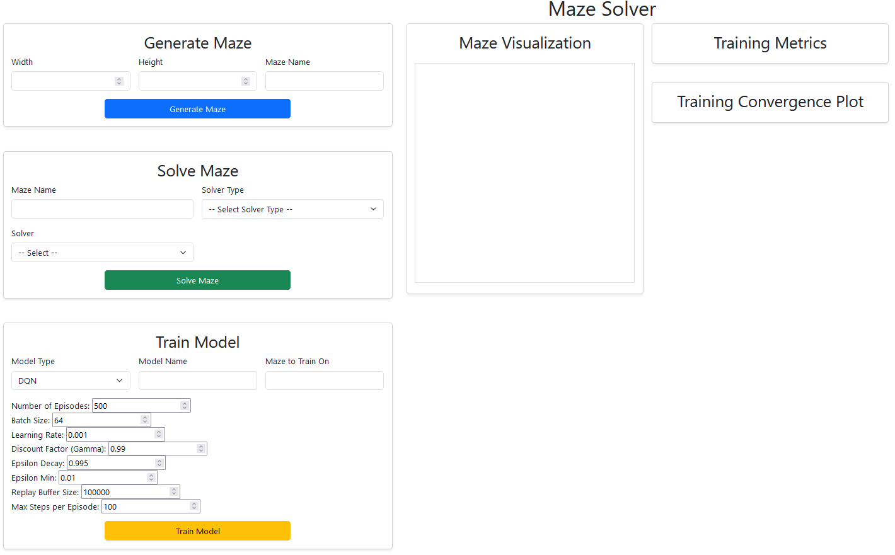
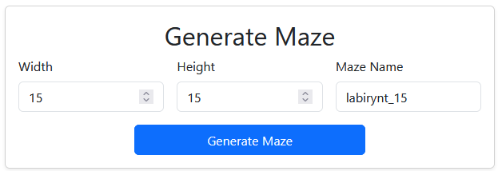
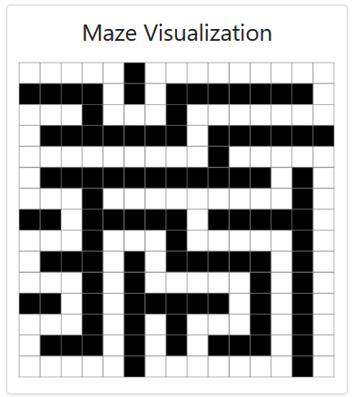
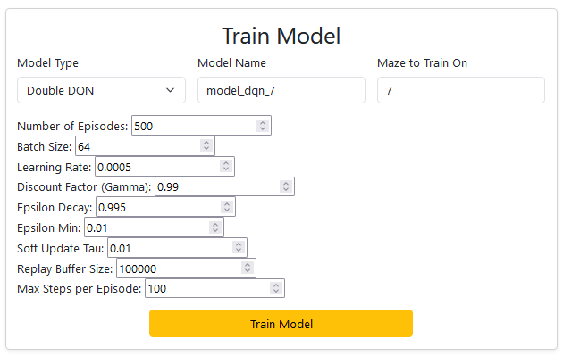
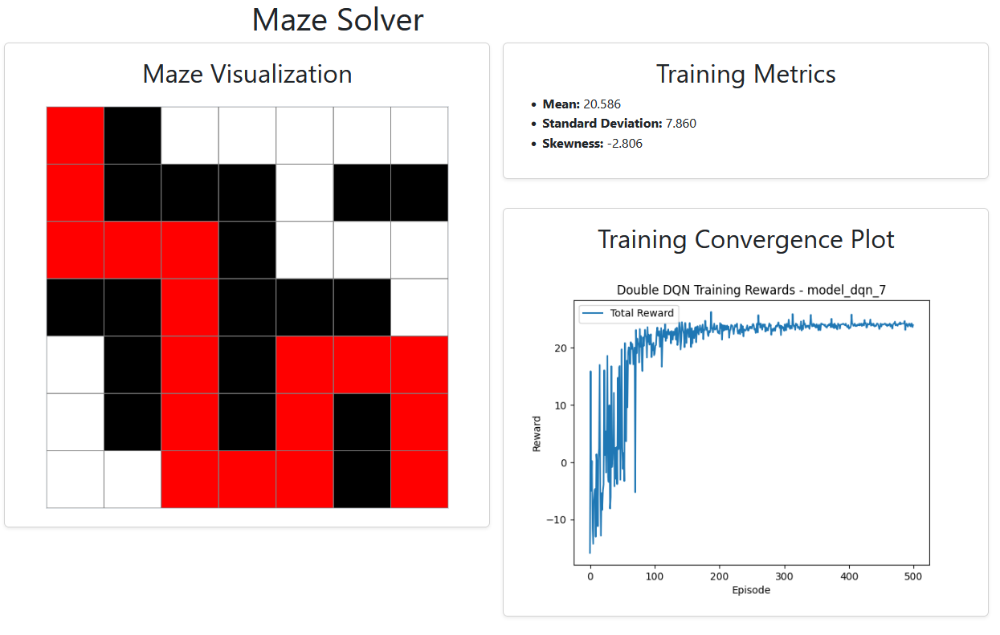

# Maze Solver
Maze Solver jest aplikacją do generowania i rozwiązywania labiryntów. 

---

## Spis Treści
1. [Wprowadzenie](#wprowadzenie)
2. [Wymagania](#wymagania)
3. [Instalacja](#instalacja)
4. [Instrukcja Użycia](#instrukcja-użycia)
5. [Szczegóły Techniczne](#szczegóły-techniczne)
6. [Architektura Systemu](#architektura-systemu)
7. [Algorytmy i Rozwiązania](#algorytmy-i-rozwiązania)
8. [Testowanie](#testowanie)
9. [Przyszły Rozwój](#przyszły-rozwój)
10. [Autorzy i Podziękowania](#autorzy-i-podziękowania)
11. [Licencja](#licencja)
---

# Wprowadzenie

Projekt **Maze Solver** to aplikacja wykorzystująca algorytmy sztucznej inteligencji i klasyczne techniki rozwiązywania problemów do znajdowania optymalnych ścieżek w labiryntach o różnej wielkości i złożoności. 

Główne cele projektu to:
- Eksploracja zastosowań algorytmów AI (np. DQN, Double DQN) i klasycznych metod (np. BFS, A*) w rozwiązywaniu labiryntów.
- Porównanie wydajności różnych podejść w kontekście czasu rozwiązania, długości ścieżki i stabilności wyników.
- Udostępnienie interfejsu webowego, który umożliwia wizualizację i analizę wyników.


## Kluczowe funkcjonalności

- **Rozwiązywanie labiryntów**:
  - Algorytmy klasyczne: BFS, A*.
  - Algorytmy oparte na AI: DQN, Double DQN, algorytmy genetyczne i PSO.
- **Generowanie i wizualizacja labiryntów**:
  - Różne rozmiary i poziomy złożoności.
- **Interfejs webowy**:
  - Zarządzanie, analiza i porównanie wyników.
- **Analityka i wizualizacja danych**:
  - Wydajność algorytmów w zależności od rozmiaru i złożoności labiryntów.


## Użyte technologie

1. **Python**:
   - Główna logika aplikacji.
   - Algorytmy rozwiązywania labiryntów.
2. **PyTorch**:
   - Funkcjonalność machine learningowa (definicje modeli, trening, rozwiązywanie labiryntów)
2. **Flask**:
   - Interfejs webowy do interakcji z użytkownikiem.
3. **Chart.js**:
   - Wizualizacja wyników i analityki.
4. **Pandoc**:
   - Automatyczna konwersja dokumentacji do formatu PDF (via Github Actions)

## Instalacja

### 1. Sklonuj repozytorium
```bash
git clone https://github.com/NatProView/project_maze_solver maze_solver
cd maze_solver
```

### 2. Utwórz wirtualne środowisko
Na systemie Linux/macOS:
```bash
python3 -m venv env
source env/bin/activate
```

Na systemie Windows:
```powershell
python -m venv env
.\env\Scripts\activate
```
### Zainstaluj zależności
```bash
pip install -r requirements.txt
```

# Instrukcja użycia
## Uruchomienie aplikacji 
Uruchom aplikację
```
python3 app.py
```
Aplikacja zwróci w terminalu informację o adresie i porcie, na którym działa. Wejdź w ten adres.

Przykładowo
```bash
python3 app.py 
 * Serving Flask app 'app'
 * Debug mode: on
WARNING: This is a development server. Do not use it in a production deployment. Use a production WSGI server instead.
 * Running on http://127.0.0.1:5000 # nasz adres
(...)
```
## Funkcjonalność
Tak wygląda strona główna aplikacji na start.

## Generowanie labiryntu
W sekcji `Generate Maze` podaj wymiary labiryntu oraz jego nazwę. 

> [!NOTE]  
> Uwaga: generator może nie wygenerować labiryntu powyżej pewnej złożoności (ok. 120x120) ze względu na rekursywną specyfikę aktualnej implementacji generatora.



Po wygenerowaniu labiryntu należy zwrócić uwagę na jego wizualizację po prawej stronie.




## Trenowanie Modelu
Założmy, że wygenerowaliśmy labirynt o wymiarach 7x7 i nazwalismy go po prostu `7`.
W sekcji Train Model możemy wybrać typ modelu (DQN, DoubleDQN, Genetic Algorithm, PSO).

Na potrzeby instrukcji wyszkolimy model Double DQN, nazwiemy go również po prostu `7` i wytrenujemy go na labiryncie `7`
Użyjemy standardowych parametrów zaproponowanych przez aplikację.



Po skończonym treningu warto zwrócić uwagę na prawą stronę naszej aplikacji.

W sekcji `Maze Visualization` widzimy rozwiązanie labiryntu wygenerowane przez wytrenowany model. 

W `Training Metrics` znajdziemy informacje o rozkładzie nagród (DQN/DoubleDQN) czy funkcji fitness(PSO, Genetic) 

`Training Convergence Plot` jest wizualizacją procesu uczenia się naszego modelu. Dla algorytmów DQN jest to wykres wartości nagród od epizodu, w PSO i Genetic Algorithm jest to wartość funkcji fitness od iteracji/pokolenia.



> [Caution]
> TODO:
> - [ ] Solve Maze opis
> - [ ] Train Model opis
> - [ ] Informacje o wykresach i metrykach

## Algorytmy i Rozwiązania

### Generowanie labiryntów (Eller's Algorithm)

Algorytm Ellera pozwala generować labirynty w sposób iteracyjny, utrzymując spójność i brak cykli w strukturze. Kluczowe cechy algorytmu:
- Tworzenie kolejnych rzędów labiryntu na podstawie zestawów (ang. sets), które łączą komórki w spójne regiony.
- Dodawanie ścian pionowych i poziomych, aby zachować strukturę labiryntu.

**Fragment kodu** (z `maze_generating.py`):

```python
def ellers_algorithm(width, height):
    if width % 2 == 0 or height % 2 == 0:
        raise ValueError("Maze dimensions must be odd for Eller's Algorithm to work properly.")

    maze = [[1 for _ in range(width)] for _ in range(height)]
    sets = list(range(width))

    for row in range(0, height - 1, 2):
        for col in range(0, width - 2, 2):
            if sets[col] != sets[col + 2] and random.choice([True, False]):
                maze[row][col + 1] = 0
                old_set = sets[col + 2]
                for i in range(width):
                    if sets[i] == old_set:
                        sets[i] = sets[col]

        next_sets = [-1] * width
        for col in range(0, width, 2):
            if next_sets[col] == -1 or random.choice([True, False]):
                next_sets[col] = sets[col]
                maze[row + 1][col] = 0 

        sets = next_sets

    maze[0][0] = 0
    maze[height - 1][width - 1] = 0
    return torch.tensor(maze, dtype=torch.float32)
```

---

### Klasyczne Algorytmy (BFS i A*)

#### BFS (Breadth-First Search / Przeszukiwanie wszerz)

Breadth-First Search (BFS) to algorytm przeszukiwania grafu, który eksploruje węzły warstwami, zaczynając od wierzchołka początkowego. BFS gwarantuje znalezienie najkrótszej ścieżki (pod względem liczby kroków) w grafie nieskierowanym, gdy wszystkie krawędzie mają jednakowy koszt.

**Implementacja:**

```python
def bfs(maze):
    start = (0, 0)  # Punkt początkowy
    goal = (len(maze) - 1, len(maze[0]) - 1)  # Punkt końcowy
    queue = deque([start])  # Kolejka wierzchołków do odwiedzenia
    came_from = {start: None}  # Słownik do śledzenia ścieżki

    while queue:
        current = queue.popleft()  # Pobranie wierzchołka z początku kolejki

        if current == goal:
            path = []  # Rekonstrukcja ścieżki
            while current:
                path.append(current)
                current = came_from[current]
            return path[::-1]  # Odwrócenie ścieżki na poprawną kolejność

        for dx, dy in [(0, 1), (1, 0), (0, -1), (-1, 0)]:  # Ruchy w czterech kierunkach
            neighbor = (current[0] + dx, current[1] + dy)
            if 0 <= neighbor[0] < len(maze) and 0 <= neighbor[1] < len(maze[0]) and maze[neighbor[0]][neighbor[1]] == 0 and neighbor not in came_from:
                queue.append(neighbor)  # Dodanie sąsiada do kolejki
                came_from[neighbor] = current  # Zapisanie poprzednika
    return []
```
**Zalety algorytmu:**
- Gwarantuje znalezienie najkrótszej ścieżki (pod względem liczby kroków) w grafie o jednakowych wagach.
- Prosta implementacja i brak potrzeby użycia heurystyki.

**Ograniczenia:**
- Wysokie zużycie pamięci w przypadku dużych grafów (przechowywanie wszystkich węzłów w kolejce).
- Może być powolny w złożonych labiryntach o dużej liczbie węzłów.

#### A* (A-Star)

A* to algorytm wyszukiwania ścieżki, który łączy zalety algorytmu Dijkstry (minimalizacja kosztu dojścia) i BFS (użycie heurystyki w celu przyspieszenia przeszukiwania). Algorytm A* wyznacza ścieżkę od punktu początkowego do celu, korzystając z następującej funkcji kosztu:

`f(n) = g(n) + h(n)`

- `g(n)`: koszt dojścia do węzła \(n\) od punktu początkowego.
- `h(n)`: heurystyka – przewidywany koszt dojścia od \(n\) do celu (np. odległość Manhattan).
- `f(n)`: łączny koszt oszacowany przez algorytm.

**Implementacja:**

```python
def a_star(maze):
    start = (0, 0)  # Punkt początkowy
    goal = (len(maze) - 1, len(maze[0]) - 1)  # Punkt końcowy
    open_set = []  # Lista węzłów do odwiedzenia
    heapq.heappush(open_set, (0, start))  # Dodanie punktu startowego do kolejki priorytetowej
    came_from = {}  # Przechowywanie poprzedników dla śledzenia ścieżki

    def heuristic(a, b):
        return abs(a[0] - b[0]) + abs(a[1] - b[1])  # Heurystyka: odległość Manhattan

    g_score = {start: 0}  # Koszt dojścia do węzła startowego wynosi 0
    f_score = {start: heuristic(start, goal)}  # Szacowany koszt przejścia od startu do celu

    while open_set:
        _, current = heapq.heappop(open_set)  # Węzeł o najniższym f-score

        if current == goal:
            path = []  # Rekonstrukcja ścieżki
            while current in came_from:
                path.append(current)
                current = came_from[current]
            return path[::-1]  # Odwrócenie ścieżki na poprawną kolejność

        for dx, dy in [(0, 1), (1, 0), (0, -1), (-1, 0)]:  # Ruchy w górę, dół, lewo, prawo
            neighbor = (current[0] + dx, current[1] + dy)
            if 0 <= neighbor[0] < len(maze) and 0 <= neighbor[1] < len(maze[0]) and maze[neighbor[0]][neighbor[1]] == 0:
                tentative_g_score = g_score[current] + 1  # Aktualizacja g(n)
                if neighbor not in g_score or tentative_g_score < g_score[neighbor]:
                    came_from[neighbor] = current  # Zapisanie poprzednika
                    g_score[neighbor] = tentative_g_score
                    f_score[neighbor] = tentative_g_score + heuristic(neighbor, goal)  # Obliczenie f(n)
                    heapq.heappush(open_set, (f_score[neighbor], neighbor))  # Dodanie sąsiada do kolejki
    return []
```

**Zalety algorytmu:**
- Gwarantuje znalezienie najkrótszej ścieżki (przy dopuszczalnej heurystyce).
- Efektywność dzięki ograniczeniu przeszukiwania niepotrzebnych gałęzi (heurystyka).

**Ograniczenia:**
- Wymaga dobrej heurystyki (niedopuszczalna heurystyka może prowadzić do błędów).
- W przypadku dużych grafów może być kosztowny pamięciowo i obliczeniowo.

---

### Algorytmy AI (DQN, Double DQN, Genetic Algorithm, PSO)

#### Double DQN (Deep Q-Learning with Double Networks)

**Opis algorytmu:**
Double DQN to rozszerzenie klasycznego algorytmu Deep Q-Network (DQN), mające na celu zredukowanie problemu przeszacowywania wartości funkcji Q. W tym celu wykorzystuje dwie sieci neuronowe:
- **Sieć główna (online)**: służy do wyboru akcji.
- **Sieć docelowa (target)**: służy do obliczania docelowej wartości Q.

Równanie aktualizacji wartości Q dla Double DQN wygląda następująco:
\[ Q(s, a) \leftarrow r + \gamma \cdot Q_{target}(s', \text{argmax}(Q_{online}(s', a'))) \]

> ![Note]
> W procesie projektowania i testowania Algorytmu DQN wystąpiło wiele problemów z procesem nauki. Podczas naprawiania problemow okazało się, że najsensowniejsze będzie użycie Double DQN, ponieważ eliminuje on główne problemy poprzednika. 
>
>Z tego powodu zostawiłem w pliku źródłowym definicję `DQNSolver` i można spróbować go wytrenować, jednak nie uzyska się sensownych wyników, więc pominąłem go w dokumentacji.
>

> ![Note]
> `Soft Update` przetlumaczyłem jako `miękka aktualizacja`, jednak nie jestem pewien tego tłumaczenia. 
> Jest to nazwa funkcji używającej współczynnika `tau`
**Implementacja krok po kroku:**

```python
class DoubleDQNSolver(Solver):
    def __init__(
        self,
        state_size=2,
        action_size=4,
        gamma=0.99,
        epsilon=1.0,
        epsilon_decay=0.995,
        epsilon_min=0.05,
        learning_rate=0.0005,
        replay_buffer_size=100000, 
        tau=0.01,
        name="double_dqn"
    ):
        super().__init__(name=name)
        # Inicjalizacja podstawowych parametrów solvera
        self.state_size = state_size
        self.action_size = action_size
        self.gamma = gamma  # Współczynnik dyskontowania (zmniejszania wpływu nagród w czasie)
        self.epsilon = epsilon  # Początkowy współczynnik eksploracji (losowych ruchów)
        self.epsilon_decay = epsilon_decay  # Tempo zmniejszania eksploracji
        self.epsilon_min = epsilon_min  # Minimalna wartość epsilon
        self.learning_rate = learning_rate  # Szybkość uczenia
        self.replay_buffer_size = replay_buffer_size  # Maksymalny rozmiar bufora doświadczeń
        self.replay_buffer = ReplayBuffer(replay_buffer_size)  # Bufor doświadczeń
        self.tau = tau  # Współczynnik aktualizacji soft update sieci docelowej (równiejszy wzrost nagród)
        self.name = name  # Nazwa solvera

        # Tworzenie sieci głównej i docelowej
        self.dqn = self._build_model()
        self.target_dqn = self._build_model()
        self.target_dqn.load_state_dict(self.dqn.state_dict())  # Inicjalizacja wag sieci docelowej
        self.replay_buffer = deque(maxlen=200_000)  # Bufor doświadczeń FIFO
        self.rewards_history = []  # Historia nagród

    def _build_model(self):
        # Budowa sieci neuronowej.
        return nn.Sequential(
            nn.Linear(self.state_size, 128),  # Warstwa wejściowa
            nn.ReLU(),  # Aktywacja ReLU
            nn.Linear(128, 128),  # Warstwa ukryta
            nn.ReLU(),
            nn.Linear(128, self.action_size)  # Warstwa wyjściowa dla Q(s, a)
        )

    def soft_update(self):
        # Aktualizacja wag sieci docelowej w sposób miękki.
        for target_param, main_param in zip(self.target_dqn.parameters(), self.dqn.parameters()):
            target_param.data.copy_(
                self.tau * main_param.data + (1 - self.tau) * target_param.data
            )

    def push_experience(self, state, action, reward, next_state, done):
        # Dodanie doświadczenia do bufora.
        self.replay_buffer.append((state, action, reward, next_state, done))

    def sample_experience(self, batch_size):
        # Pobranie losowych próbek z bufora.
        return random.sample(self.replay_buffer, batch_size)

    def train(self, env, num_episodes=500, batch_size=64, max_steps=100):
        # Proces treningu agenta.
        optimizer = optim.Adam(self.dqn.parameters(), lr=self.learning_rate)  # Optymalizator Adam
        log_file = os.path.join("logs_detailed/double_dqn", f"{self.name}_double_dqn_log.csv")
        os.makedirs("logs_detailed/double_dqn", exist_ok=True)
        with open(log_file, "w", newline="") as csvfile:
            writer = csv.writer(csvfile)
            writer.writerow(["episode", "total_reward", "epsilon"])
            
            for episode in range(num_episodes):
                state = np.array(env.reset(), dtype=np.float32)  # Reset środowiska
                total_reward = 0

                for _ in range(max_steps):
                    # Wybór akcji: eksploracja lub eksploatacja
                    if random.random() < self.epsilon:
                        action = random.randint(0, self.action_size - 1)  # Losowa akcja
                    else:
                        with torch.no_grad():
                            action = torch.argmax(self.dqn(torch.tensor(state))).item()  # Akcja oparta na Q

                    # Wykonanie akcji w środowisku
                    next_state, reward, done = env.step(action)
                    next_state = np.array(next_state, dtype=np.float32)

                    # Dodanie doświadczenia do bufora
                    self.push_experience(state, action, reward, next_state, done)

                    state = next_state
                    total_reward += reward
                    writer.writerow([episode, total_reward, self.epsilon])
                    if done:
                        break

                    # Trening na próbkach z bufora
                    if len(self.replay_buffer) >= batch_size:
                        self._replay(optimizer, batch_size)

                # Aktualizacja sieci docelowej
                self.soft_update()

                # Aktualizacja współczynnika eksploracji
                self.epsilon = max(self.epsilon * self.epsilon_decay, self.epsilon_min)
                self.rewards_history.append(total_reward)

                print(f"[Episode {episode}] Reward: {total_reward:.2f}, Eps: {self.epsilon:.2f}")
                
            # Rysowanie wykresu nagród
            self.plot_rewards()
            metrics = self.calculate_metrics(self.rewards_history)
            metrics_file = os.path.join("metrics/double_dqn", f"{self.name}.txt")
            os.makedirs("metrics/double_dqn", exist_ok=True)
            self.log_to_file(f"Metrics: {metrics}", metrics_file)
            return self.dqn, metrics

    def _replay(self, optimizer, batch_size):
        # Proces aktualizacji wag sieci głównej.
        transitions = self.sample_experience(batch_size)
        states, actions, rewards, next_states, dones = zip(*transitions)

        states = torch.tensor(states, dtype=torch.float32)
        actions = torch.tensor(actions, dtype=torch.int64)
        rewards = torch.tensor(rewards, dtype=torch.float32)
        next_states = torch.tensor(next_states, dtype=torch.float32)
        dones = torch.tensor(dones, dtype=torch.float32)

        # Obliczanie wartości Q dla aktualnych stanów
        q_values = self.dqn(states).gather(1, actions.unsqueeze(1)).squeeze(1)

        with torch.no_grad():
            # Obliczanie wartości Q dla przyszłych stanów
            next_actions = self.dqn(next_states).argmax(1).unsqueeze(1)
            next_q_values = self.target_dqn(next_states).gather(1, next_actions).squeeze(1)

        # Wyznaczanie wartości docelowych
        targets = rewards + self.gamma * next_q_values * (1 - dones)

        # Obliczanie straty i optymalizacja sieci głównej
        loss = nn.MSELoss()(q_values, targets)
        optimizer.zero_grad()
        loss.backward()
        optimizer.step()

    def solve(self, env, max_steps=300):
        # Rozwiązywanie labiryntu przez agenta.
        state = np.array(env.reset(), dtype=np.float32)
        path = [env.start]

        for _ in range(max_steps):
            with torch.no_grad():
                action = torch.argmax(self.dqn(torch.tensor(state))).item()

            next_state, reward, done = env.step(action)
            path.append(env.agent_pos)

            if done:
                print("Goal reached by Double DQN!")
                break

            state = np.array(next_state, dtype=np.float32)

        return path
    
    def save(self, file_path):
        # Zapis wytrenowanego modelu.
        torch.save({
            'model_state': self.dqn.state_dict(),
            'state_size': self.state_size,
            'action_size': self.action_size,
            'gamma': self.gamma,
            'epsilon': self.epsilon,
            'epsilon_decay': self.epsilon_decay,
            'epsilon_min': self.epsilon_min,
            'learning_rate': self.learning_rate,
            'tau': self.tau,
            'replay_buffer_size': self.replay_buffer_size
        }, file_path)
        
    @staticmethod
    def load(file_path):
        # Wczytanie modelu z pliku.
        checkpoint = torch.load(file_path)
        solver = DoubleDQNSolver(
            state_size=checkpoint['state_size'],
            action_size=checkpoint['action_size'],
            gamma=checkpoint['gamma'],
            epsilon=checkpoint['epsilon'],
            epsilon_decay=checkpoint['epsilon_decay'],
            epsilon_min=checkpoint['epsilon_min'],
            learning_rate=checkpoint['learning_rate'],
            tau=checkpoint.get('tau', 0.01),
            replay_buffer_size=checkpoint.get('replay_buffer_size', 100000)
        )
        solver.dqn.load_state_dict(checkpoint['model_state'])
        solver.target_dqn.load_state_dict(solver.dqn.state_dict())
        return solver
    
    def plot_rewards(self):
        # Generowanie wykresu nagród w czasie treningu.
        plt.figure()
        plt.plot(self.rewards_history, label="Total Reward")
        plt.xlabel("Episode")
        plt.ylabel("Reward")
        plt.title(f"Double DQN Training Rewards - {self.name}")
        plt.legend()
        file_path = os.path.join(self.log_dir, "double_dqn", f"{self.name}.png")
        os.makedirs(os.path.join(self.log_dir, "double_dqn"), exist_ok=True)
        plt.savefig(file_path)
        plt.close()
```

**Wyjaśnienie kroków implementacji DoubleDQNSolver:**

1. **Inicjalizacja:**
   - `self.dqn` i `self.target_dqn`: Dwie sieci neuronowe, gdzie `self.dqn` jest siecią główną służącą do podejmowania decyzji, a `self.target_dqn` jest siecią docelową wykorzystywaną do stabilizacji uczenia.
   - `self.replay_buffer`: Bufor doświadczeń przechowujący przeszłe stany, akcje, nagrody i kolejne stany, umożliwiający doświadczenie rozproszone w czasie.
   - `self.epsilon`: Parametr eksploracji, określający prawdopodobieństwo wyboru losowej akcji.

2. **Trening (`train`):**
   - W każdej iteracji (`num_episodes`):
     - Reset środowiska (`env.reset`) i ustawienie stanu początkowego.
     - Eksploracja lub eksploatacja:
       - Jeśli `random.random() < self.epsilon`, wybór losowej akcji (eksploracja).
       - W przeciwnym razie wybór akcji maksymalizującej wartość Q za pomocą `self.dqn` (eksploatacja).
     - Wykonanie akcji w środowisku (`env.step`), zapis doświadczenia w buforze i aktualizacja stanu.
     - Jeśli bufor zawiera wystarczającą ilość danych, wywoływana jest metoda `_replay` w celu przeprowadzenia uczenia.
   - `self.epsilon` zmniejsza się w trakcie treningu (exploration decay via `epsilon decay`), co zwiększa nacisk na eksploatację w późniejszych etapach.

3. **Replay (`_replay`):**
   - Losowe próbkowanie z bufora doświadczeń, co zapobiega korelacjom w danych treningowych.
   - Obliczanie wartości Q:
     - `q_values`: Aktualne wartości Q dla wybranych akcji.
     - `next_q_values`: Wartości Q docelowe obliczane na podstawie `self.target_dqn` i indeksów akcji z sieci głównej (`self.dqn`).
   - Docelowe wartości Q (`targets`) obliczane jako suma nagrody i zdyskontowanej wartości Q następnego stanu.
   - Obliczanie straty (`loss`) jako różnica między wartościami Q a wartościami docelowymi i aktualizacja wag sieci głównej (`self.dqn`).

4. **Rozwiązywanie (`solve`):**
   - Agent wykonuje kroki w środowisku, korzystając wyłącznie z sieci głównej (`self.dqn`).
   - Przechodzenie od stanu początkowego do celu, zapisując kroki w ścieżce (`path`).

5. **Aktualizacja sieci docelowej:**
   - Co pewną liczbę epizodów parametry sieci docelowej są synchronizowane z siecią główną, co zapewnia stabilność procesu uczenia.

6. **Zapis wyników:**
   - Wartości nagród i inne metryki są zapisywane, umożliwiając analizę konwergencji i jakości rozwiązania.

**Środowisko MazeEnvDQN:**
- `MazeEnvDQN` to klasa definiująca środowisko, w którym agent działa.
- Metody kluczowe:
  - `reset()`: resetuje stan środowiska.
  - `step(action)`: wykonuje akcję, aktualizuje pozycję agenta i zwraca nowy stan, nagrodę i flagę zakończenia.

**Fragment kodu:**

```python
class MazeEnvDQN:
    def __init__(self, grid):
        self.grid = grid
        self.start = (0, 0)
        self.goal = (len(grid) - 1, len(grid[0]) - 1)
        self.reset()

    # Resetuje środowisko do stanu początkowego.
    def reset(self):
        self.agent_pos = self.start
        return self.agent_pos
    
    # Wykonuje ruch i zwraca nowy stan, nagrodę oraz flagę zakończenia
    def step(self, action):
        moves = [(0, -1), (-1, 0), (0, 1), (1, 0)]
        next_pos = (self.agent_pos[0] + moves[action][0],
                    self.agent_pos[1] + moves[action][1])

        if (0 <= next_pos[0] < self.n_rows and
            0 <= next_pos[1] < self.n_cols and
            self.grid[next_pos[0]][next_pos[1]] == 0):
            self.agent_pos = next_pos

        # Sprawdź, czy agent znajduje sie w tunelu (czyli możemy uprościć jego proces decyzyjny do dwoch kierunków)          
        while not self.is_junction(self.agent_pos) and self.agent_pos != self.goal:
            possible_moves = self.get_possible_moves(self.agent_pos)
            if len(possible_moves) == 1:
                move = possible_moves[0]
                self.agent_pos = (self.agent_pos[0] + move[0],
                                  self.agent_pos[1] + move[1])
            else:
                break

        distance_to_goal = abs(self.agent_pos[0] - self.goal[0]) + abs(self.agent_pos[1] - self.goal[1])

        if self.agent_pos == self.goal:
            reward = 10 # nagradzamy za dotarcie do celu
        elif self.agent_pos not in self.visited:
            reward = 1 - 0.01 * distance_to_goal # nagradzamy za zbliżenie się do celu
        else:
            reward = -0.1 - 0.01 * distance_to_goal # karzemy za powtórzenie ruchu

        self.visited.add(self.agent_pos)
        done = (self.agent_pos == self.goal)
        return self.agent_pos, reward, done
   
    # sprawdzenie, czy agent znajduje się na skrzyżowaniu
    def is_junction(self, pos):
        return len(self.get_possible_moves(pos)) > 1
```

#### Genetic Algorithm (GA)

**Opis algorytmu:**
Genetic Algorithm (GA) to heurystyczny algorytm inspirowany procesem ewolucji biologicznej. Używa operacji genetycznych, takich jak selekcja, krzyżowanie i mutacja, aby iteracyjnie poprawiać rozwiązania problemu. W kontekście labiryntów GA optymalizuje ścieżkę od startu do celu.

**Kluczowe elementy algorytmu:**
- **Populacja:** Zbiór możliwych rozwiązań (ścieżek) w danej iteracji.
- **Funkcja fitness:** Ocena jakości rozwiązania, np. długości ścieżki lub odległości do celu.
- **Selekcja:** Wybór najlepszych osobników na podstawie ich fitness.
- **Krzyżowanie (crossover):** Łączenie dwóch osobników, aby stworzyć nowe rozwiązania.
- **Mutacja:** Wprowadzenie losowych zmian w osobnikach, aby zwiększyć różnorodność.

**Implementacja:**

```python
class GeneticSolver(Solver):
    def __init__(
        self,
        population_size=200,
        generations=500,
        mutation_rate=0.1,
        crossover_rate=0.2,
        elite_fraction=0.02,
        checkpoint_interval=250,
        name="generic_genetic"
    ):
        super().__init__(name=name)
        self.population_size = population_size  # Rozmiar populacji
        self.generations = generations  # Liczba iteracji (generacji)
        self.mutation_rate = mutation_rate  # Prawdopodobieństwo mutacji
        self.crossover_rate = crossover_rate  # Prawdopodobieństwo krzyżowania
        self.elite_fraction = elite_fraction  # Procent najlepszych osobników zachowywanych bez zmian
        self.checkpoint_interval = checkpoint_interval  # Interwał zapisu stanu algorytmu

    def generate_population(self, solution_length):
        # Generowanie początkowej populacji.
        return torch.randint(0, 4, (self.population_size, solution_length), dtype=torch.int)

    def evaluate_individual(self, env, individual):
        # Ocena jednego osobnika na podstawie funkcji fitness.
        env.reset()
        total_reward = 0.0
        for action in individual:
            _, reward, done = env.step(action.item())
            total_reward += reward
            if done:
                break
        return total_reward

    def evaluate_population(self, env, population):
        # Ocena całej populacji.
        fitness_scores = torch.zeros(self.population_size, dtype=torch.float)
        for i, individual in enumerate(population):
            fitness_scores[i] = self.evaluate_individual(env, individual)
        return fitness_scores

    def tournament_selection(self, ranked_population, fitness_scores, tournament_size=2):
        # Selekcja turniejowa: wybór najlepszych osobników spośród losowo wybranych.
        selected = []
        pop_len = len(ranked_population)
        for _ in range(pop_len):
            tournament_indices = torch.randint(0, pop_len, (tournament_size,))
            best_idx = tournament_indices[torch.argmax(fitness_scores[tournament_indices])]
            selected.append(ranked_population[best_idx])
        return torch.stack(selected)

    def crossover(self, parent1, parent2):
        # Krzyżowanie dwóch osobników.
        if random.random() > self.crossover_rate:
            return parent1.clone()
        cut = random.randint(1, len(parent1) - 1)
        return torch.cat((parent1[:cut], parent2[cut:]))

    def mutate(self, individual, mutation_rate):
        # Mutacja osobnika.
        mutation_mask = torch.rand(len(individual)) < mutation_rate
        random_mutations = torch.randint(0, 4, (len(individual),), dtype=individual.dtype)
        individual[mutation_mask] = random_mutations[mutation_mask]
        return individual

    def train(self, env):
        solution_length = 2 * (env.n_rows + env.n_cols)  # Szacowana długość rozwiązania
        population = self.generate_population(solution_length)  # Generowanie początkowej populacji

        num_elites = max(1, int(self.elite_fraction * self.population_size))

        for generation in range(self.generations):
            fitness_scores = self.evaluate_population(env, population)  # Ocena populacji
            ranked_indices = torch.argsort(fitness_scores, descending=True)
            ranked_population = population[ranked_indices]

            elites = ranked_population[:num_elites]  # Wybór najlepszych osobników (elity)

            # Selekcja rodziców i tworzenie nowej populacji
            parents = self.tournament_selection(ranked_population, fitness_scores, tournament_size=2)
            new_population = []
            for _ in range(self.population_size - num_elites):
                parent1 = parents[random.randint(0, len(parents) - 1)]
                parent2 = parents[random.randint(0, len(parents) - 1)]
                child = self.crossover(parent1, parent2)  # Krzyżowanie
                child = self.mutate(child, self.mutation_rate)  # Mutacja
                new_population.append(child)

            population = torch.vstack([elites] + new_population)  # Nowa populacja

            # Logowanie postępów
            print(f"Generation {generation}: Best fitness = {fitness_scores[ranked_indices[0]]:.3f}")

        # Zwrócenie najlepszego rozwiązania
        return ranked_population[0]
```

**Wyjaśnienie kroków implementacji:**
1. **Inicjalizacja:**
   - `population_size`, `generations`, `mutation_rate` itp. definiują parametry algorytmu.
   - Początkowa populacja jest generowana losowo przez `generate_population`.

2. **Ocena populacji:**
   - `evaluate_individual` ocenia pojedynczego osobnika, sumując nagrody uzyskane w środowisku.
   - `evaluate_population` oblicza wyniki dla całej populacji.

3. **Selekcja:**
   - `tournament_selection` wybiera najlepszych rodziców spośród losowo wybranych osobników.

4. **Krzyżowanie i mutacja:**
   - `crossover` łączy dwóch rodziców w jedno potomstwo.
   - `mutate` wprowadza losowe zmiany w genomie potomstwa.

5. **Tworzenie nowej populacji:**
   - Najlepsi osobnicy są zachowywani bez zmian.
   - Reszta populacji jest tworzona poprzez krzyżowanie i mutację rodziców.

6. **Logowanie i wynik:**
   - Algorytm loguje najlepsze wyniki w każdej generacji.
   - Po zakończeniu zwraca najlepszego osobnika.

**Środowisko MazeEnvGenetic:**

Środowisko `MazeEnvGenetic` definiuje reguły działania agenta w labiryncie dla algorytmu genetycznego. W odróżnieniu od środowisk używanych w Reinforcement Learning, MazeEnvGenetic działa w kontekście oceny całej ścieżki (genomu).

**Kluczowe elementy środowiska:**
- **Stan początkowy:** Pozycja agenta jest ustawiana na \((0, 0)\).
- **Akcje:** Reprezentowane jako liczby całkowite \([0, 1, 2, 3]\) odpowiadające ruchom: lewo, góra, prawo, dół.
- **Nagroda:** Obliczana na podstawie odległości do celu, odwiedzania nowych komórek i osiągnięcia celu.

**Implementacja środowiska:**

```python
class MazeEnvGenetic:
    def __init__(self, grid):
        self.grid = grid
        self.n_rows = len(grid)
        self.n_cols = len(grid[0])
        self.start = (0, 0)
        self.goal = (self.n_rows - 1, self.n_cols - 1)
        self.reset()

    def reset(self):
        # Resetuje środowisko do stanu początkowego.
        self.agent_pos = self.start  # Ustawienie agenta na pozycji startowej
        self.visited = set([self.agent_pos])  # Śledzenie odwiedzonych komórek
        self.prev_distance = abs(self.agent_pos[0] - self.goal[0]) + abs(self.agent_pos[1] - self.goal[1])
        return self.agent_pos

    def get_possible_moves(self, pos):
        # Zwraca listę możliwych ruchów z danej pozycji.
        moves = [(0, -1), (-1, 0), (0, 1), (1, 0)]  # Lewo, góra, prawo, dół
        possible_moves = []
        for move in moves:
            nx, ny = pos[0] + move[0], pos[1] + move[1]
            if 0 <= nx < self.n_rows and 0 <= ny < self.n_cols and self.grid[nx][ny] == 0:
                possible_moves.append(move)
        return possible_moves

    def step(self, action):
        # Wykonuje akcję i zwraca nowy stan, nagrodę oraz flagę zakończenia.
        moves = [(0, -1), (-1, 0), (0, 1), (1, 0)]  # Definicje akcji
        dx, dy = moves[action]  # Mapowanie akcji na przesunięcie
        next_pos = (self.agent_pos[0] + dx, self.agent_pos[1] + dy)

        # Sprawdzenie, czy ruch jest możliwy (poza ściany i granice)
        distance_before = abs(self.agent_pos[0] - self.goal[0]) + abs(self.agent_pos[1] - self.goal[1])
        if (0 <= next_pos[0] < self.n_rows and
            0 <= next_pos[1] < self.n_cols and
            self.grid[next_pos[0]][next_pos[1]] == 0):
            self.agent_pos = next_pos

        # Automatyczne przechodzenie przez tunel (jeśli brak skrzyżowań)
        while not self.is_junction(self.agent_pos) and self.agent_pos != self.goal:
            possible_moves = self.get_possible_moves(self.agent_pos)
            if len(possible_moves) == 1:
                move = possible_moves[0]
                self.agent_pos = (self.agent_pos[0] + move[0], self.agent_pos[1] + move[1])
            else:
                break

        # Obliczenie nagrody na podstawie odległości do celu
        distance_after = abs(self.agent_pos[0] - self.goal[0]) + abs(self.agent_pos[1] - self.goal[1])
        done = False
        if self.agent_pos == self.goal:
            reward = 20.0  # Nagroda za osiągnięcie celu
            done = True
        else:
            reward = 0.0
            if self.agent_pos in self.visited:
                reward -= 1.0  # Kara za odwiedzenie tej samej komórki
            if distance_after < distance_before:
                reward += 0.3  # Nagroda za zbliżenie się do celu
            else:
                reward -= 0.1  # Kara za oddalenie się od celu

        self.visited.add(self.agent_pos)
        self.prev_distance = distance_after
        return self.agent_pos, reward, done

    def is_junction(self, pos):
        # Sprawdza, czy dana pozycja jest skrzyżowaniem.
        return len(self.get_possible_moves(pos)) > 1
    
    # używane do debugowego wyświetlania labiryntu w terminalu
    def render(self):
        # Wyświetla aktualny stan labiryntu.
        for r in range(self.n_rows):
            for c in range(self.n_cols):
                if (r, c) == self.agent_pos:
                    print("A", end=" ")  # Agent
                elif self.grid[r][c] == 1:
                    print("#", end=" ")  # Ściana
                else:
                    print(".", end=" ")  # Pusta komórka
            print()
        print()
```

#### PSO (Particle Swarm Optimization)

**Opis algorytmu:**
Particle Swarm Optimization (PSO) to algorytm optymalizacji inspirowany zachowaniem rojów, takich jak stada ptaków czy ławice ryb. W PSO każda cząstka (ang. particle) reprezentuje potencjalne rozwiązanie i porusza się w przestrzeni rozwiązań na podstawie swojego doświadczenia oraz doświadczenia całego roju. Celem jest znalezienie optymalnej ścieżki w labiryncie.


**Kluczowe elementy algorytmu:**
- **Swarm (rój):** Grupa cząstek, z których każda reprezentuje możliwe rozwiązanie.
- **Fitness:** Funkcja oceniająca jakość rozwiązania (ścieżki).
- **Inercja i współczynniki:** Parametry kontrolujące dynamikę ruchu cząstek:
  - `inertia`: wpływ poprzedniej prędkości.
  - `cognitive_coeff`: wpływ najlepszej lokalnej pozycji cząstki.
  - `social_coeff`: wpływ globalnej najlepszej pozycji.

**Implementacja:**

```python
class PSOSolver(Solver):
    def __init__(
        self,
        swarm_size=50,
        max_iterations=500,
        inertia=0.5,
        cognitive_coeff=1.5,
        social_coeff=1.5,
        checkpoint_interval=50,
        name="generic_pso"
    ):
        super().__init__(name=name)
        self.swarm_size = swarm_size  # Liczba cząstek w roju
        self.max_iterations = max_iterations  # Maksymalna liczba iteracji
        self.inertia = inertia  # Współczynnik inercji
        self.cognitive_coeff = cognitive_coeff  # Współczynnik poznawczy
        self.social_coeff = social_coeff  # Współczynnik społeczny
        self.convergence_history = []  # Historia najlepszego wyniku w każdej iteracji
        self.best_solution = None  # Najlepsze rozwiązanie globalne

    def initialize_swarm(self, solution_length):
        # Inicjalizuje pozycje i prędkości cząstek.
        positions = torch.randint(0, 4, (self.swarm_size, solution_length), dtype=torch.int)
        velocities = torch.zeros_like(positions, dtype=torch.float)
        return positions, velocities

    def evaluate_particle(self, env, particle):
        # Ocena jednej cząstki na podstawie funkcji fitness.
        env.reset()
        total_reward = 0
        for action in particle:
            _, reward, done = env.step(action.item())
            total_reward += reward
            if done:
                break
        return total_reward

    def evaluate_swarm(self, env, swarm):
        # Ocena całego roju.
        fitness_scores = torch.zeros(self.swarm_size, dtype=torch.float)
        for i, particle in enumerate(swarm):
            fitness_scores[i] = self.evaluate_particle(env, particle)
        return fitness_scores

    def train(self, env):
        # Trenuje algorytm PSO w podanym środowisku.
        solution_length = 2 * (env.n_rows + env.n_cols)  # Przybliżona długość ścieżki
        swarm, velocities = self.initialize_swarm(solution_length)

        # Inicjalizacja najlepszych lokalnych i globalnych wyników
        personal_best_positions = swarm.clone()
        personal_best_scores = self.evaluate_swarm(env, swarm)

        global_best_index = torch.argmax(personal_best_scores)
        global_best_position = personal_best_positions[global_best_index].clone()
        global_best_score = personal_best_scores[global_best_index].item()

        for iteration in range(self.max_iterations):
            progress = iteration / self.max_iterations

            for i in range(self.swarm_size):
                r1 = torch.rand(solution_length)
                r2 = torch.rand(solution_length)

                # Aktualizacja prędkości
                velocities[i] = (
                    self.inertia * velocities[i]
                    + self.cognitive_coeff * r1 * (personal_best_positions[i] - swarm[i]).float()
                    + self.social_coeff * r2 * (global_best_position - swarm[i]).float()
                )

                # Aktualizacja pozycji
                new_position = swarm[i].float() + velocities[i]
                new_position = torch.clamp(new_position, 0, 3).long()

                swarm[i] = new_position

                # Ocena nowej pozycji
                fitness = self.evaluate_particle(env, swarm[i])
                if fitness > personal_best_scores[i]:
                    personal_best_scores[i] = fitness
                    personal_best_positions[i] = swarm[i].clone()

            # Aktualizacja globalnego najlepszego wyniku
            global_best_index = torch.argmax(personal_best_scores)
            current_best_score = personal_best_scores[global_best_index].item()
            if current_best_score > global_best_score:
                global_best_score = current_best_score
                global_best_position = personal_best_positions[global_best_index].clone()

            # Logowanie postępów
            self.convergence_history.append(global_best_score)
            print(f"Iteration {iteration}: Best fitness = {global_best_score:.3f}")

        self.best_solution = global_best_position.clone()
        return self.best_solution

    def solve(self, env, max_steps=None):
        # Rozwiązuje problem w środowisku na podstawie najlepszej znalezionej ścieżki.
        if self.best_solution is None:
            raise ValueError("Brak najlepszego rozwiązania! Najpierw wytrenuj solver.")

        path = []
        env.reset()
        for idx, action in enumerate(self.best_solution):
            if max_steps is not None and idx >= max_steps:
                break
            state, reward, done = env.step(action.item())
            path.append(state)
            if done:
                print("Goal reached by PSOSolver!")
                break
        return path
```

**Wyjaśnienie kroków implementacji:**
1. **Inicjalizacja:**
   - `initialize_swarm` generuje początkowe pozycje i prędkości cząstek.
   - Każda cząstka ma przypisaną najlepszą pozycję lokalną oraz wynik globalny.

2. **Ocena cząstek:**
   - `evaluate_particle` oblicza całkowitą nagrodę dla pojedynczej cząstki.
   - `evaluate_swarm` zwraca wyniki dla całego roju.

3. **Aktualizacja cząstek:**
   - Prędkość każdej cząstki jest aktualizowana na podstawie wzoru PSO.
   - Pozycje są zmieniane zgodnie z nowymi prędkościami i ograniczane do przestrzeni akcji.

4. **Logowanie:**
   - Najlepszy wynik w każdej iteracji jest zapisywany w historii konwergencji.

5. **Wynik:**
   - Po zakończeniu iteracji zwracana jest najlepsza znaleziona ścieżka.

**Środowisko MazeEnvPSO:**
Środowisko `MazeEnvPSO` definiuje zasady, według których każda cząstka symuluje swoją ścieżkę w labiryncie. Jest ono dostosowane do wymagań algorytmu PSO, gdzie każda cząstka jest oceniana na podstawie funkcji fitness.

**Kluczowe elementy środowiska:**
- **Stan początkowy:** Pozycja agenta zaczyna się na `(0, 0)`.
- **Akcje:** Liczby całkowite `[0, 1, 2, 3]` reprezentujące ruchy: lewo, góra, prawo, dół.
- **Nagroda:** Ocena jakości ścieżki na podstawie odległości do celu, odwiedzania nowych komórek i osiągnięcia celu.

**Implementacja środowiska:**

```python
class MazeEnvPSO:
    def __init__(self, grid):
        self.grid = grid  # Siatka labiryntu (0 - pusta komórka, 1 - ściana)
        self.n_rows = len(grid)
        self.n_cols = len(grid[0])
        self.start = (0, 0)  # Pozycja startowa
        self.goal = (self.n_rows - 1, self.n_cols - 1)  # Pozycja końcowa
        self.reset()

    def reset(self):
        # Resetuje środowisko do stanu początkowego.
        self.agent_pos = self.start  # Ustawienie agenta na pozycji startowej
        self.visited = set([self.agent_pos])  # Śledzenie odwiedzonych komórek
        self.prev_distance = abs(self.agent_pos[0] - self.goal[0]) + abs(self.agent_pos[1] - self.goal[1])
        return self.agent_pos

    def get_possible_moves(self, pos):
        # Zwraca listę możliwych ruchów z danej pozycji.
        moves = [(0, -1), (-1, 0), (0, 1), (1, 0)]  # Lewo, góra, prawo, dół
        possible_moves = []
        for move in moves:
            nx, ny = pos[0] + move[0], pos[1] + move[1]
            if 0 <= nx < self.n_rows and 0 <= ny < self.n_cols and self.grid[nx][ny] == 0:
                possible_moves.append(move)
        return possible_moves

    def step(self, action):
        # Wykonuje akcję i zwraca nowy stan, nagrodę oraz flagę zakończenia.
        moves = [(0, -1), (-1, 0), (0, 1), (1, 0)]  # Definicje akcji
        dx, dy = moves[action]  # Mapowanie akcji na przesunięcie
        next_pos = (self.agent_pos[0] + dx, self.agent_pos[1] + dy)

        # Sprawdzenie, czy ruch jest możliwy (poza ściany i granice)
        distance_before = abs(self.agent_pos[0] - self.goal[0]) + abs(self.agent_pos[1] - self.goal[1])
        if (0 <= next_pos[0] < self.n_rows and
            0 <= next_pos[1] < self.n_cols and
            self.grid[next_pos[0]][next_pos[1]] == 0):
            self.agent_pos = next_pos

        # Automatyczne przechodzenie przez tunel (jeśli brak skrzyżowań)
        while not self.is_junction(self.agent_pos) and self.agent_pos != self.goal:
            possible_moves = self.get_possible_moves(self.agent_pos)
            if len(possible_moves) == 1:
                move = possible_moves[0]
                self.agent_pos = (self.agent_pos[0] + move[0], self.agent_pos[1] + move[1])
            else:
                break

        # Obliczenie nagrody na podstawie odległości do celu
        distance_after = abs(self.agent_pos[0] - self.goal[0]) + abs(self.agent_pos[1] - self.goal[1])
        done = False
        if self.agent_pos == self.goal:
            reward = 50.0  # Nagroda za osiągnięcie celu
            done = True
        else:
            reward = 0.0
            if self.agent_pos in self.visited:
                reward -= 1.0  # Kara za odwiedzenie tej samej komórki
            if distance_after < distance_before:
                reward += 0.2  # Nagroda za zbliżenie się do celu
            else:
                reward -= 0.1  # Kara za oddalenie się od celu

        self.visited.add(self.agent_pos)
        self.prev_distance = distance_after
        return self.agent_pos, reward, done

    def is_junction(self, pos):
        # Sprawdza, czy dana pozycja jest skrzyżowaniem.
        return len(self.get_possible_moves(pos)) > 1

    def render(self):
        # Wyświetla aktualny stan labiryntu.
        for r in range(self.n_rows):
            for c in range(self.n_cols):
                if (r, c) == self.agent_pos:
                    print("A", end=" ")  # Agent
                elif self.grid[r][c] == 1:
                    print("#", end=" ")  # Ściana
                else:
                    print(".", end=" ")  # Pusta komórka
            print()
        print()
```

---


## Szczegóły Techniczne
Struktura projektu wygląda następująco

```bash
├── .github/             # Workflows GitHuba
│   ├── workflows/
├── logs/                # Wykresy uczenia modeli AI
│   ├── double_dqn/
│   ├── dqn/
│   ├── genetic/
│   └── pso/
├── logs_detailed/       # Logi z informacją o tempie uczenia się modeli 
│   ├── double_dqn/
│   ├── dqn/
│   ├── genetic/
│   └── pso/
├── mazes/               # Wygenerowane przez użytkownika labirynty 
├── metrics/             # Metryki związane z trenowaniem modeli AI
│   ├── double_dqn/
│   ├── dqn/
│   ├── genetic/
│   └── pso/
├── static/              # pliki css, js
├── templates/           # pliki html
├── trained_models/      # wytrenowane już modele AI
│   ├── double_dqn/
│   ├── dqn/
│   ├── genetic/
│   └── pso/
├── app.py              # Punkt startowy aplikacji (Flask, endpointy)
├── models.py           # Definicje modeli AI
├── maze_generating.py  # Generowanie labiryntów
├── maze_solving.py     # Rozwiązywanie labiryntów algorytmami nie-ai
```